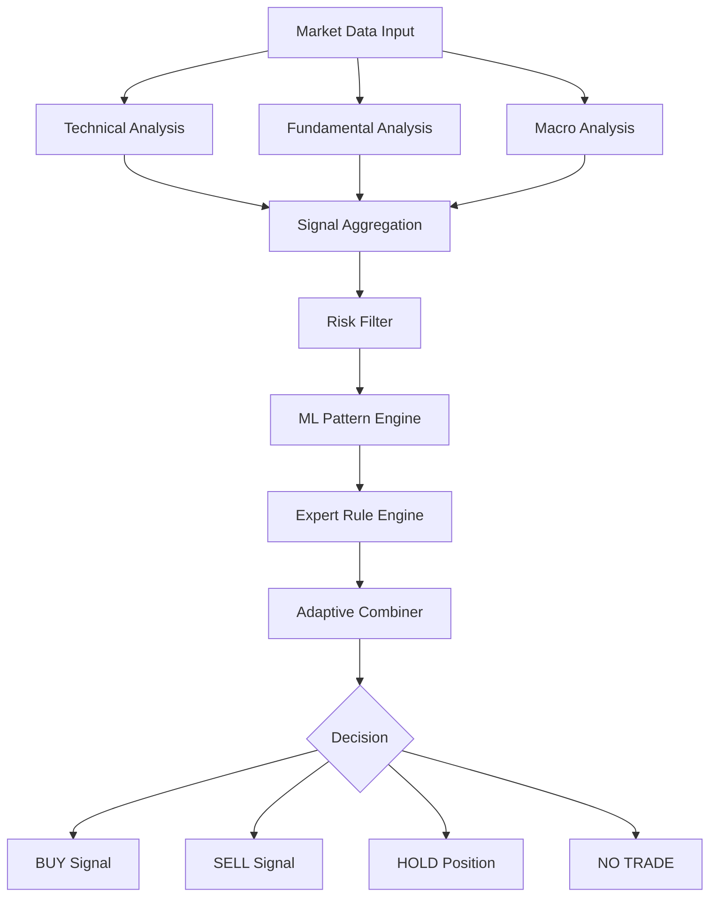

# 📊 БИЗНЕС-ЛОГИКА ТОРГОВЛИ
## Bybit Trading Bot - Детальная торговая стратегия и логика принятия решений

**Дата:** 2025-08-27 17:00:00  
**Версия:** 1.0

---

## 🎯 ОБЩАЯ КОНЦЕПЦИЯ ТОРГОВЛИ

### 📈 **Торговая философия:**
- **Мульти-факторный анализ** - объединение технического, фундаментального и макроэкономического анализа
- **Адаптивный подход** - система подстраивается под разные рыночные условия
- **Risk-first approach** - приоритет управления рисками над максимизацией прибыли
- **Data-driven decisions** - решения основаны на количественном анализе данных

### 🎲 **Торговые временные рамки:**
- **Основной timeframe:** 4 часа (4H)
- **Подтверждающие timeframes:** 1H, 1D
- **Максимальное время в позиции:** 72 часа
- **Торговое расписание:** 24/7 с паузами во время низкой волатильности

---

## 🧠 ГИБРИДНЫЙ АЛГОРИТМ ПРИНЯТИЯ РЕШЕНИЙ

### 🔍 **Структура Decision Engine:**



### 💧**Компоненты алгоритма:**

#### **1. Risk Filter (Фильтр рисков)**
```typescript
interface RiskFilter {
  checkPositionLimits(): boolean;
  checkCorrelationLimits(): boolean;
  checkVolatilityLimits(): boolean;
  checkMarketConditions(): boolean;
  checkAccountHealth(): boolean;
}
```

**Критерии фильтрации:**
- Максимальный размер позиции: 5% от портфеля
- Максимальная корреляция между позициями: 0.7
- Максимальная волатильность актива: 15% за 24h
- Минимальная ликвидность: $1M объем за 24h
- Исключение торговли во время major news events

#### **2. ML Pattern Engine (ML анализ паттернов)**
```python
class MLPatternEngine:
    def __init__(self):
        self.lstm_model = LSTMPricePredictor()
        self.pattern_classifier = RandomForestClassifier()
        self.confidence_threshold = 0.65
    
    def predict_price_movement(self, market_data):
        # LSTM предсказание направления цены
        price_prediction = self.lstm_model.predict(market_data)
        
        # Классификация торгового паттерна
        pattern = self.pattern_classifier.predict(market_data)
        
        confidence = self.calculate_confidence(price_prediction, pattern)
        
        return {
            'direction': price_prediction,
            'pattern': pattern,
            'confidence': confidence
        }
```

#### **3. Expert Rule Engine (Экспертные правила)**
```typescript
interface ExpertRules {
  // Тренд-следующие правила
  trendFollowingRules(): TradingSignal;
  
  // Контр-трендовые правила
  meanReversionRules(): TradingSignal;
  
  // Breakout правила
  breakoutRules(): TradingSignal;
  
  // Макро-контекстные правила
  macroContextRules(): TradingSignal;
}
```

#### **4. Adaptive Combiner (Адаптивный комбинатор)**
```typescript
interface AdaptiveCombiner {
  marketRegime: 'bull_trend' | 'bear_trend' | 'sideways' | 'high_volatility';
  weights: {
    technical: number;
    fundamental: number;
    macro: number;
    ml_prediction: number;
  };
  
  combineSignals(signals: SignalSet): FinalDecision;
  adaptWeights(performanceData: PerformanceMetrics): void;
}
```

---

## 📊 ТЕХНИЧЕСКИЙ АНАЛИЗ КОМПОНЕНТ

### 🔢 **17+ Технических индикаторов:**

#### **Momentum индикаторы:**
- **RSI (Relative Strength Index)**
  - Период: 14
  - Oversold: < 30, Overbought: > 70
  - Сигнал покупки: RSI < 30 + divergence
  - Сигнал продажи: RSI > 70 + divergence

- **MACD (Moving Average Convergence Divergence)**
  - Параметры: 12, 26, 9
  - Сигнал покупки: MACD пересекает signal line снизу вверх
  - Сигнал продажи: MACD пересекает signal line сверху вниз

- **Stochastic Oscillator**
  - Параметры: %K=14, %D=3
  - Сигнал покупки: %K < 20 и %K пересекает %D снизу вверх
  - Сигнал продажи: %K > 80 и %K пересекает %D сверху вниз

#### **Trend индикаторы:**
- **Moving Averages (SMA, EMA)**
  - Периоды: 20, 50, 200
  - Сигнал покупки: цена выше EMA20 > EMA50 > EMA200
  - Сигнал продажи: цена ниже EMA20 < EMA50 < EMA200

- **ADX (Average Directional Index)**
  - Период: 14
  - Сильный тренд: ADX > 25
  - Слабый тренд: ADX < 20
  - Сигнал входа только при ADX > 25

#### **Volume индикаторы:**
- **OBV (On-Balance Volume)**
  - Сигнал покупки: OBV растет при росте цены
  - Сигнал продажи: OBV падает при росте цены (divergence)

- **VWAP (Volume Weighted Average Price)**
  - Сигнал покупки: цена выше VWAP + растущий объем
  - Сигнал продажи: цена ниже VWAP + растущий объем

### 🎯 **Правила генерации сигналов:**

#### **BUY Signal условия:**
```typescript
interface BuySignalCriteria {
  // Минимум 3 из 5 условий должны выполняться
  rsi_oversold: boolean;        // RSI < 35
  macd_bullish: boolean;        // MACD crossover bullish
  price_above_ema: boolean;     // Price > EMA20
  volume_confirmation: boolean;  // Volume > average volume
  support_level: boolean;       // Price near support level
}
```

#### **SELL Signal условия:**
```typescript
interface SellSignalCriteria {
  // Минимум 3 из 5 условий должны выполняться
  rsi_overbought: boolean;      // RSI > 65
  macd_bearish: boolean;        // MACD crossover bearish
  price_below_ema: boolean;     // Price < EMA20
  volume_confirmation: boolean;  // Volume > average volume
  resistance_level: boolean;    // Price near resistance level
}
```

#### **NO TRADE условия:**
```typescript
interface NoTradeConditions {
  low_volatility: boolean;      // ATR < 2% от цены
  choppy_market: boolean;       // ADX < 20
  major_news_event: boolean;    // Scheduled news в течение 2 часов
  weekend_low_volume: boolean;  // Выходные + объем < 50% average
}
```

---

## 📰 ФУНДАМЕНТАЛЬНЫЙ АНАЛИЗ

### 📈 **News Sentiment Analysis:**

#### **Источники новостей:**
- **CoinTelegraph API** - криптовалютные новости
- **NewsNow API** - общие финансовые новости
- **Twitter/X API** - социальные sentiment
- **Reddit API** - community sentiment
- **Telegram channels** - crypto influencers

#### **Sentiment Classification:**
```python
class SentimentAnalyzer:
    def analyze_news(self, article):
        sentiment_score = self.nlp_model.predict(article.content)
        
        # Шкала от -1 (очень негативно) до +1 (очень позитивно)
        if sentiment_score > 0.3:
            return 'BULLISH'
        elif sentiment_score < -0.3:
            return 'BEARISH'
        else:
            return 'NEUTRAL'
    
    def calculate_weighted_sentiment(self, news_list):
        # Взвешиваем по важности источника и времени публикации
        weighted_score = sum(
            news.sentiment * news.source_weight * news.recency_weight
            for news in news_list
        )
        return weighted_score
```

#### **Trading правила на основе sentiment:**
- **Bullish news (sentiment > 0.6):** Увеличиваем веса BUY сигналов на 20%
- **Bearish news (sentiment < -0.6):** Увеличиваем веса SELL сигналов на 20%
- **Contradictory sentiment:** Снижаем размер позиции на 50%
- **No significant news:** Стандартные веса

---

## 🌍 МАКРОЭКОНОМИЧЕСКИЙ АНАЛИЗ

### 📊 **Макро-факторы:**

#### **US Economic Indicators:**
- **Federal Funds Rate**
  - Повышение ставки: Negative для crypto (-10% к BUY сигналам)
  - Понижение ставки: Positive для crypto (+15% к BUY сигналам)

- **CPI Inflation Data**
  - CPI выше ожиданий: Negative для crypto
  - CPI ниже ожиданий: Positive для crypto

- **DXY (US Dollar Index)**
  - DXY растет: Negative корреляция с crypto
  - DXY падает: Positive корреляция с crypto

#### **Traditional Markets Correlation:**
- **S&P 500 / Nasdaq**
  - Высокая корреляция в периоды стресса
  - Снижение risk-on позиций при падении индексов

- **VIX (Volatility Index)**
  - VIX > 30: Снижение размера позиций на 30%
  - VIX < 15: Стандартные размеры позиций

### 🔗 **Crypto-specific макро факторы:**

#### **On-chain метрики:**
- **Exchange inflows/outflows**
  - Большие inflows: Bearish signal
  - Большие outflows: Bullish signal

- **Whale movements**
  - Перемещения > $10M: Временная пауза в торговле

- **Stablecoin market cap**
  - Рост USDT/USDC market cap: Bullish (больше денег готово войти)
  - Падение market cap: Bearish

---

## ⚖️ СИСТЕМА ВЕСОВЫХ КОЭФФИЦИЕНТОВ

### 🎯 **Adaptive Weight System:**

#### **Базовые веса по рыночным режимам:**

```typescript
const MarketRegimeWeights = {
  bull_trend: {
    technical: 0.4,
    fundamental: 0.3, 
    macro: 0.2,
    ml_prediction: 0.1
  },
  bear_trend: {
    technical: 0.3,
    fundamental: 0.4,
    macro: 0.3,
    ml_prediction: 0.0  // ML хуже работает в bear market
  },
  sideways: {
    technical: 0.5,
    fundamental: 0.2,
    macro: 0.2,
    ml_prediction: 0.1
  },
  high_volatility: {
    technical: 0.2,
    fundamental: 0.3,
    macro: 0.4,
    ml_prediction: 0.1
  }
};
```

#### **Performance-based адаптация:**
```typescript
class WeightOptimizer {
  adaptWeights(pastPerformance: PerformanceData) {
    // Анализируем performance каждого компонента за последние 30 дней
    const componentPerformance = this.analyzeComponentPerformance(pastPerformance);
    
    // Увеличиваем веса для лучше работающих компонентов
    for (let component in componentPerformance) {
      if (componentPerformance[component].sharpe_ratio > 1.5) {
        this.weights[component] *= 1.1;  // Увеличиваем на 10%
      } else if (componentPerformance[component].sharpe_ratio < 0.5) {
        this.weights[component] *= 0.9;  // Уменьшаем на 10%
      }
    }
    
    // Нормализуем веса чтобы сумма = 1
    this.normalizeWeights();
  }
}
```

---

## 🎲 ПОЗИЦИОНИРОВАНИЕ И SIZING

### 📏 **Position Sizing Rules:**

#### **Базовый размер позиции:**
```typescript
function calculatePositionSize(signal: TradingSignal, account: Account): number {
  const baseSize = account.balance * 0.02; // 2% от баланса
  
  // Корректировки на основе confidence
  let adjustedSize = baseSize;
  
  if (signal.confidence > 0.8) {
    adjustedSize *= 1.5;  // Увеличиваем до 3%
  } else if (signal.confidence < 0.6) {
    adjustedSize *= 0.5;  // Уменьшаем до 1%
  }
  
  // Корректировки на волатильность
  const volatilityAdjustment = Math.min(1.0, 0.05 / signal.asset_volatility);
  adjustedSize *= volatilityAdjustment;
  
  // Максимальный размер позиции
  return Math.min(adjustedSize, account.balance * 0.05); // Не более 5%
}
```

#### **Kelly Criterion адаптация:**
```typescript
function kellyOptimalSize(signal: TradingSignal, historicalData: HistoricalPerformance): number {
  const winRate = historicalData.win_rate;
  const avgWin = historicalData.average_win;
  const avgLoss = historicalData.average_loss;
  
  // Kelly formula: f = (bp - q) / b
  // где b = avgWin/avgLoss, p = winRate, q = 1-winRate
  const b = avgWin / avgLoss;
  const kellyFraction = (b * winRate - (1 - winRate)) / b;
  
  // Консервативный подход: используем 25% от Kelly
  return Math.max(0, kellyFraction * 0.25);
}
```

---

## ⛔ RISK MANAGEMENT ПРАВИЛА

### 🛡️ **Stop Loss Strategy:**

#### **Динамический Stop Loss:**
```typescript
function calculateStopLoss(entry: Entry, volatility: number): number {
  // Базовый stop loss на основе ATR
  const atrStopLoss = entry.price * (1 - 2 * volatility);
  
  // Технический stop loss (поддержка/сопротивление)
  const technicalStopLoss = this.findNearestSupportLevel(entry.price);
  
  // Берем наиболее консервативный
  return Math.max(atrStopLoss, technicalStopLoss);
}
```

#### **Take Profit Strategy:**
```typescript
function calculateTakeProfit(entry: Entry, stopLoss: number): number[] {
  const riskAmount = entry.price - stopLoss;
  
  // Множественные take profit уровни
  return [
    entry.price + riskAmount * 1.5,  // TP1: Risk/Reward 1:1.5
    entry.price + riskAmount * 2.5,  // TP2: Risk/Reward 1:2.5
    entry.price + riskAmount * 4.0   // TP3: Risk/Reward 1:4.0
  ];
}
```

### 🚨 **Emergency Stop Conditions:**

#### **Portfolio-level stops:**
- **Daily loss limit:** 3% от портфеля
- **Weekly loss limit:** 8% от портфеля
- **Maximum drawdown:** 15% от peak портфеля
- **Correlation breach:** Более 3 коррелированных позиций

#### **Market condition stops:**
- **Extreme volatility:** ATR > 10% для major coins
- **Flash crash detection:** Падение > 15% за 15 минут
- **Exchange issues:** API errors > 5 за минуту
- **Regulatory news:** Major regulatory announcements

---

## 📈 BACKTESTING СТРАТЕГИИ

### 🧪 **Historical Performance Testing:**

#### **Тестовые параметры:**
- **Период тестирования:** 2 года исторических данных
- **Starting capital:** $100,000
- **Transaction costs:** 0.1% за сделку
- **Slippage:** 0.05% на liquid pairs

#### **Ожидаемые метрики:**
```typescript
interface ExpectedPerformance {
  annual_return: number;        // Цель: 15-25%
  sharpe_ratio: number;         // Цель: > 1.5
  max_drawdown: number;         // Лимит: < 15%
  win_rate: number;             // Ожидание: 55-65%
  profit_factor: number;        // Цель: > 1.4
  
  monthly_consistency: number;  // % прибыльных месяцев > 60%
  correlation_with_btc: number; // < 0.8
}
```

### 📊 **A/B Testing Framework:**

#### **Strategy Variants Testing:**
```typescript
class StrategyABTesting {
  variants = [
    'conservative',  // Меньшие позиции, строже фильтры
    'aggressive',    // Большие позиции, больше сигналов
    'trend_focused', // Больше веса трендовым индикаторам
    'mean_reversion' // Больше веса контр-трендовым сигналам
  ];
  
  async runParallelTest(duration: number) {
    // Запускаем все варианты параллельно с одинаковыми market conditions
    // Сравниваем performance через duration
  }
}
```

---

## 🎯 КРИТЕРИИ УСПЕХА СТРАТЕГИИ

### ✅ **Performance Targets:**

#### **Финансовые метрики:**
- **ROI:** 15-30% годовых после комиссий
- **Sharpe Ratio:** > 1.5
- **Maximum Drawdown:** < 15%
- **Win Rate:** 55-70%
- **Profit Factor:** > 1.4

#### **Операционные метрики:**
- **Signal Quality:** < 15% false signals
- **Execution Speed:** Decision to order < 200ms
- **System Uptime:** > 99.5%
- **Risk Compliance:** 100% соблюдение лимитов

#### **Адаптивность:**
- **Regime Detection Accuracy:** > 80%
- **Weight Adaptation Speed:** Реакция в течение 1 недели
- **Performance in Different Markets:** Positive results в bull/bear/sideways

---

**📊 Данная торговая логика обеспечивает systematic approach к принятию торговых решений с акцентом на risk management и адаптивность к изменяющимся рыночным условиям.**
