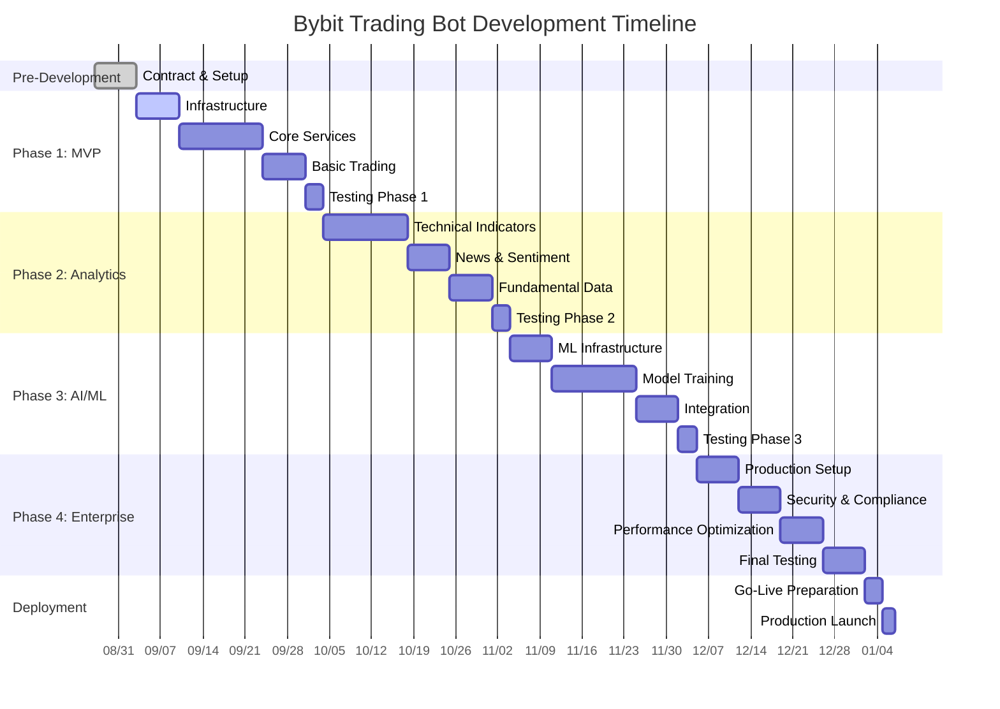

# ⏰ ВРЕМЕННЫЕ РАМКИ И ЭТАПЫ
## Bybit Trading Bot - Детальный timeline и milestones

**Дата:** 2025-08-27 16:45:00  
**Версия:** 1.0

---

## 📅 ОБЩИЙ TIMELINE ПРОЕКТА

### 🎯 **Ключевые параметры:**
- **Общая длительность:** 18-22 недели (4.5-5.5 месяцев)
- **Рабочие дни:** 5 дней в неделю
- **Команда:** 4-6 специалистов
- **Методология:** Agile Scrum (спринты по 2 недели)
- **Старт проекта:** После подписания контракта
- **Окончание:** Полная приемка и запуск в продакшн

### 📊 **Gantt Chart Overview:**

---

## 🚀 PHASE 1: MVP - БАЗОВАЯ ТОРГОВАЯ СИСТЕМА

### 📋 **Общие параметры Phase 1:**
- **Длительность:** 4-5 недель
- **Команда:** 4 человека
- **Спринты:** 2-3 спринта по 2 недели
- **Бюджет:** $25,000 - $35,000

### 🗓️ **Детальный timeline Phase 1:**

#### **Week 1: Infrastructure Setup**
**Sprint 1.1 (Days 1-7)**

| День | Активности | Ответственный | Deliverables |
|------|------------|---------------|--------------|
| **День 1-2** | Environment setup, Git repo, CI/CD | DevOps Engineer | Working development environment |
| **День 3-4** | Database setup (PostgreSQL, MongoDB, Redis) | Backend Developer | Database schemas created |
| **День 5-7** | Docker containers, docker-compose | DevOps Engineer | Containerized infrastructure |

**Milestone M1.1:** ✅ Development environment готов

#### **Week 2-3: Core Services Development**
**Sprint 1.2 (Days 8-21)**

| Неделя | Сервис | Задачи | Команда |
|--------|--------|--------|---------|
| **Week 2** | Auth Service | JWT auth, user management, 2FA | Senior Full-Stack Developer |
| **Week 2** | API Gateway | Routing, rate limiting, middleware | Backend Developer |
| **Week 3** | Market Data Service | Bybit API integration, WebSocket | Senior Full-Stack Developer |
| **Week 3** | Technical Analysis | Basic indicators (RSI, MACD, MA) | Backend Developer |

**Milestone M1.2:** ✅ Core services работают

#### **Week 4: Trading Engine**
**Sprint 1.3 (Days 22-28)**

| День | Компонент | Задачи | Статус |
|------|-----------|--------|--------|
| **22-24** | Decision Engine | Basic decision logic, signal aggregation | Development |
| **25-26** | Trading Service | Order execution, position management | Development |
| **27-28** | Risk Service | Basic risk controls, position limits | Development |

**Milestone M1.3:** ✅ Торговая логика работает

#### **Week 5: Testing & Integration**
**Sprint 1.4 (Days 29-35)**

| Тип тестирования | Длительность | Ответственный | Критерии приемки |
|------------------|--------------|---------------|------------------|
| **Unit Testing** | 2 дня | All Developers | Coverage > 80% |
| **Integration Testing** | 2 дня | QA Engineer | All services communicate |
| **User Acceptance** | 2 дня | Product Owner | MVP criteria met |
| **Performance Testing** | 1 день | DevOps Engineer | Latency < 500ms |

**Milestone M1.4:** ✅ MVP готов к demo

### 🎯 **Phase 1 Deliverables:**
- [ ] Рабочий MVP с базовой торговлей
- [ ] Web dashboard для мониторинга
- [ ] 5-7 технических индикаторов
- [ ] Базовые риск-контроли
- [ ] API документация
- [ ] Unit и integration тесты

---

## 📊 PHASE 2: РАСШИРЕННАЯ АНАЛИТИКА

### 📋 **Общие параметры Phase 2:**
- **Длительность:** 4-5 недель
- **Команда:** 5 человек (+ ML Engineer)
- **Спринты:** 2-3 спринта
- **Бюджет:** $30,000 - $40,000

### 🗓️ **Детальный timeline Phase 2:**

#### **Week 6-7: Technical Indicators Expansion**
**Sprint 2.1 (Days 36-49)**

| Индикатор группа | Индикаторы | Время | Разработчик |
|------------------|------------|-------|-------------|
| **Momentum** | ADX, Stochastic, CCI | 3 дня | Backend Dev 1 |
| **Volume** | MFI, OBV, VWAP | 3 дня | Backend Dev 2 |
| **Support/Resistance** | Fibonacci, Pivot Points | 4 дня | Senior Developer |
| **Advanced** | Ichimoku Cloud, ATR | 4 дня | Technical Analyst |

**Milestone M2.1:** ✅ 17+ индикаторов реализованы

#### **Week 8: Fundamental Analysis**
**Sprint 2.2 (Days 50-56)**

| Компонент | API Integration | Время | Команда |
|-----------|-----------------|-------|---------|
| **News Service** | CoinTelegraph, NewsNow | 3 дня | Backend Dev |
| **Social Sentiment** | Twitter/X, Reddit APIs | 2 дня | ML Engineer |
| **Sentiment Analysis** | NLP model integration | 2 дня | ML Engineer |

**Milestone M2.2:** ✅ Фундаментальный анализ работает

#### **Week 9: Macro Data & Weight System**
**Sprint 2.3 (Days 57-63)**

| Сервис | Задачи | Время | Разработчик |
|--------|--------|-------|-------------|
| **Macro Data Service** | Fed data, DXY, Treasury yields | 3 дня | Backend Dev |
| **Weight System** | Adaptive weights, regime detection | 3 дня | Senior Developer |
| **Enhanced Dashboard** | Analytics UI, performance charts | 2 дня | Frontend Dev |

**Milestone M2.3:** ✅ Система весов адаптируется

#### **Week 10: Integration & Testing**
**Sprint 2.4 (Days 64-70)**

| Активность | Фокус | Время | Команда |
|------------|-------|-------|---------|
| **Service Integration** | All analysis services working together | 2 дня | All Team |
| **Performance Testing** | Signal generation speed, accuracy | 2 дня | QA + DevOps |
| **User Testing** | Enhanced dashboard, new features | 2 дня | Product Owner |
| **Bug Fixes** | Issue resolution | 1 день | All Team |

**Milestone M2.4:** ✅ Phase 2 готова

### 🎯 **Phase 2 Deliverables:**
- [ ] 17+ технических индикаторов
- [ ] Фундаментальный анализ новостей
- [ ] Социальный sentiment анализ
- [ ] Макроэкономические данные
- [ ] Адаптивная система весов
- [ ] Расширенная аналитика в UI

---

## [AI] PHASE 3: AI И МАШИННОЕ ОБУЧЕНИЕ

### 📋 **Общие параметры Phase 3:**
- **Длительность:** 5-6 недель
- **Команда:** 6 человек (2 ML Engineers)
- **Спринты:** 3 спринта
- **Бюджет:** $40,000 - $55,000

### 🗓️ **Детальный timeline Phase 3:**

#### **Week 11-12: ML Infrastructure**
**Sprint 3.1 (Days 71-84)**

| Компонент | Задачи | Время | Команда |
|-----------|--------|-------|---------|
| **ML Service Setup** | Python FastAPI service | 2 дня | ML Engineer 1 |
| **Data Pipeline** | Feature engineering, data prep | 4 дня | ML Engineer 2 |
| **Model Storage** | MLflow, model versioning | 2 дня | DevOps Engineer |
| **Training Infrastructure** | GPU setup, training pipeline | 4 дня | ML Engineer 1 |

**Milestone M3.1:** ✅ ML инфраструктура готова

#### **Week 13-14: Model Development**
**Sprint 3.2 (Days 85-98)**

| Модель | Назначение | Время | ML Engineer |
|--------|------------|-------|-------------|
| **LSTM Price Predictor** | Price movement prediction | 5 дней | ML Engineer 1 |
| **Random Forest Classifier** | Pattern classification | 4 дней | ML Engineer 2 |
| **Sentiment Classifier** | News sentiment analysis | 3 дней | ML Engineer 1 |
| **Feature Engineering** | Optimal feature selection | 2 дня | ML Engineer 2 |

**Milestone M3.2:** ✅ ML модели обучены

#### **Week 15: Integration & Optimization**
**Sprint 3.3 (Days 99-105)**

| Задача | Описание | Время | Команда |
|--------|----------|-------|---------|
| **Hybrid Decision Engine** | ML + rules integration | 3 дня | Senior Dev + ML |
| **Performance Optimization** | Model inference speed | 2 дня | ML Engineers |
| **A/B Testing Framework** | Strategy comparison | 2 дня | Backend Dev |

**Milestone M3.3:** ✅ Гибридная система работает

#### **Week 16: Backtesting & Validation**
**Sprint 3.4 (Days 106-112)**

| Компонент | Задачи | Время | Команда |
|-----------|--------|-------|---------|
| **Backtesting Engine** | Historical simulation | 3 дня | Senior Developer |
| **Model Validation** | Performance metrics | 2 дня | ML Engineers |
| **Strategy Optimization** | Parameter tuning | 2 дня | Trading Expert |

**Milestone M3.4:** ✅ ML система валидирована

### 🎯 **Phase 3 Deliverables:**
- [ ] LSTM модель для предсказания цен
- [ ] Классификатор торговых паттернов
- [ ] Гибридный алгоритм принятия решений
- [ ] Backtesting система
- [ ] A/B testing framework
- [ ] Performance attribution по ML моделям

---

## 🏢 PHASE 4: ENTERPRISE И ПРОДАКШН

### 📋 **Общие параметры Phase 4:**
- **Длительность:** 4-5 недель
- **Команда:** 5 человек
- **Спринты:** 2-3 спринта
- **Бюджет:** $35,000 - $45,000

### 🗓️ **Детальный timeline Phase 4:**

#### **Week 17-18: Production Infrastructure**
**Sprint 4.1 (Days 113-126)**

| Компонент | Задачи | Время | Команда |
|-----------|--------|-------|---------|
| **High Availability** | Load balancing, failover | 4 дня | DevOps Engineer |
| **Security Hardening** | Penetration testing, fixes | 4 дня | Security Expert |
| **Monitoring Setup** | Prometheus, Grafana, alerts | 3 дня | DevOps Engineer |
| **Backup Systems** | Automated backups, DR | 3 дня | DevOps Engineer |

**Milestone M4.1:** ✅ Production infrastructure готова

#### **Week 19: Enterprise Features**
**Sprint 4.2 (Days 127-133)**

| Функция | Описание | Время | Разработчик |
|---------|----------|-------|-------------|
| **Multi-Account Management** | Multiple trading accounts | 3 дня | Senior Developer |
| **Role-Based Access** | Advanced permissions | 2 дня | Backend Developer |
| **Audit Logging** | Compliance logging | 2 дня | Backend Developer |

**Milestone M4.2:** ✅ Enterprise функции работают

#### **Week 20: Final Testing & Deployment**
**Sprint 4.3 (Days 134-140)**

| Тип тестирования | Фокус | Время | Команда |
|------------------|-------|-------|---------|
| **Load Testing** | 1000+ concurrent users | 2 дня | QA + DevOps |
| **Security Testing** | Penetration testing | 2 дня | Security Team |
| **User Acceptance** | Final client approval | 2 дня | Product Owner |
| **Production Deployment** | Go-live procedures | 1 день | All Team |

**Milestone M4.3:** ✅ Production deployment

### 🎯 **Phase 4 Deliverables:**
- [ ] Production-ready система
- [ ] High availability setup
- [ ] Security audit passed
- [ ] Multi-tenant поддержка
- [ ] Comprehensive monitoring
- [ ] Disaster recovery plan

---

## 🧪 TESTING & QA PHASE

### 📋 **Общие параметры Testing:**
- **Длительность:** 2-3 недели (параллельно с Phase 4)
- **Команда:** 3-4 человека
- **Бюджет:** $15,000 - $25,000

### 🗓️ **Testing Timeline:**

#### **Week 19-20: Comprehensive Testing**

| Тип тестирования | Описание | Длительность | Команда |
|------------------|----------|--------------|---------|
| **Unit Testing** | Individual component tests | Continuous | Developers |
| **Integration Testing** | Service interaction tests | 3 дня | QA Engineer |
| **Performance Testing** | Load, stress, endurance | 4 дня | DevOps + QA |
| **Security Testing** | Vulnerability assessment | 3 дня | Security Expert |
| **User Acceptance** | Business scenario testing | 4 дня | Product Owner |

#### **Week 21: Final Validation**

| Активность | Цель | Время | Участники |
|------------|------|-------|-----------|
| **Bug Fixes** | Critical issues resolution | 3 дня | Dev Team |
| **Performance Tuning** | Optimization based on tests | 2 дня | Senior Devs |
| **Documentation Review** | Final doc updates | 1 день | Tech Writer |
| **Go-Live Readiness** | Final checklist validation | 1 день | Project Manager |

---

## 📊 RISK TIMELINE & MITIGATION

### [Warning] **Критические риски по фазам:**

#### **Phase 1 Risks:**
| Риск | Вероятность | Влияние | Митигация | Доп. время |
|------|-------------|---------|-----------|------------|
| **Bybit API изменения** | 30% | Высокое | API version pinning | +1 неделя |
| **Team onboarding delay** | 20% | Среднее | Pre-project preparation | +3 дня |
| **Infrastructure issues** | 25% | Среднее | Cloud provider backup | +2 дня |

#### **Phase 2 Risks:**
| Риск | Вероятность | Влияние | Митигация | Доп. время |
|------|-------------|---------|-----------|------------|
| **External API limitations** | 40% | Среднее | Alternative data sources | +1 неделя |
| **Indicator complexity** | 35% | Среднее | Phased implementation | +3 дня |
| **Performance bottlenecks** | 30% | Высокое | Early optimization | +1 неделя |

#### **Phase 3 Risks:**
| Риск | Вероятность | Влияние | Митигация | Доп. время |
|------|-------------|---------|-----------|------------|
| **ML model accuracy** | 45% | Высокое | Multiple model approaches | +2 недели |
| **Training data quality** | 35% | Среднее | Data validation pipeline | +1 неделя |
| **Integration complexity** | 40% | Высокое | Incremental integration | +1 неделя |

### [Security] **Общие митигации:**
- **Buffer time:** 15% дополнительное время в каждой фазе
- **Parallel development:** Независимые компоненты разрабатываются параллельно
- **Early testing:** Continuous integration и testing
- **Regular reviews:** Еженедельные progress reviews
- **Scope flexibility:** Возможность deprioritize non-critical features

---

## 📅 MILESTONE CALENDAR

### 🎯 **Ключевые контрольные точки:**

| Milestone | Дата | Критерии готовности | Stakeholder Review |
|-----------|------|---------------------|-------------------|
| **M1: MVP Demo** | Week 5 | Базовая торговля работает | Product Owner + Trading Expert |
| **M2: Analytics Demo** | Week 10 | 17+ индикаторов + новости | Product Owner + Analysts |
| **M3: AI Integration** | Week 16 | ML модели в production | Product Owner + ML Experts |
| **M4: Production Ready** | Week 20 | Security + Performance OK | All Stakeholders |
| **M5: Go-Live** | Week 21 | Production deployment | Business Stakeholders |

### 📊 **Reporting Schedule:**

#### **Weekly Reports (Every Friday):**
- Progress against plan
- Completed deliverables
- Upcoming week plan
- Risks and issues
- Resource utilization

#### **Phase Reviews (End of each phase):**
- Comprehensive demo
- Performance metrics
- Quality assessment
- Lessons learned
- Next phase planning

#### **Executive Updates (Bi-weekly):**
- High-level progress
- Budget status
- Timeline adherence
- Major risks
- Key decisions needed

---

## 🎯 SUCCESS METRICS BY PHASE

### 📊 **Phase 1 Success Metrics:**
- [ ] **Functional:** MVP демонстрирует автоматическую торговлю
- [ ] **Technical:** Response time < 500ms, uptime > 99%
- [ ] **Quality:** Test coverage > 80%, no critical bugs
- [ ] **Business:** Trading logic validated by expert

### 📊 **Phase 2 Success Metrics:**
- [ ] **Functional:** 17+ индикаторов + фундаментальный анализ
- [ ] **Technical:** Signal generation < 200ms
- [ ] **Quality:** Indicator accuracy validated
- [ ] **Business:** Improved signal quality demonstrated

### 📊 **Phase 3 Success Metrics:**
- [ ] **Functional:** ML модели интегрированы и работают
- [ ] **Technical:** Model inference < 100ms
- [ ] **Quality:** ML accuracy > 65% на test data
- [ ] **Business:** Backtesting показывает improvement

### 📊 **Phase 4 Success Metrics:**
- [ ] **Functional:** Production deployment успешен
- [ ] **Technical:** System handles 1000+ users
- [ ] **Quality:** Security audit passed
- [ ] **Business:** Client acceptance criteria met

---

**⏰ Данный timeline обеспечивает поэтапную поставку ценности с возможностью корректировки scope и приоритетов на основе feedback заказчика.**
