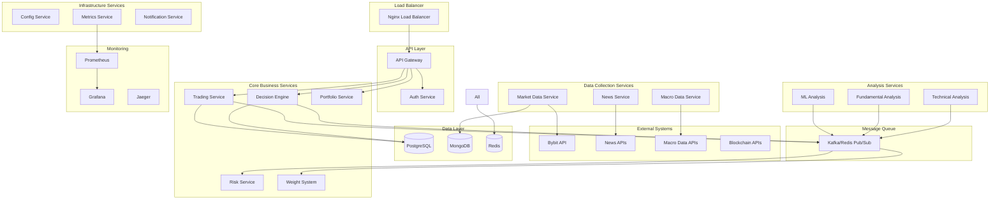
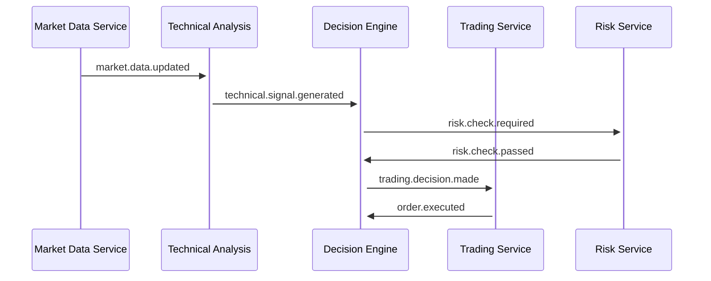
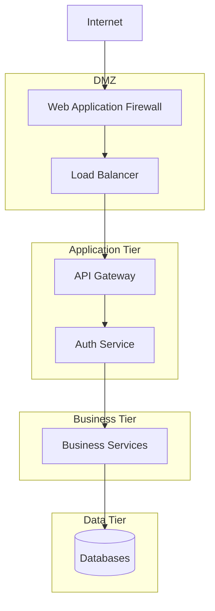
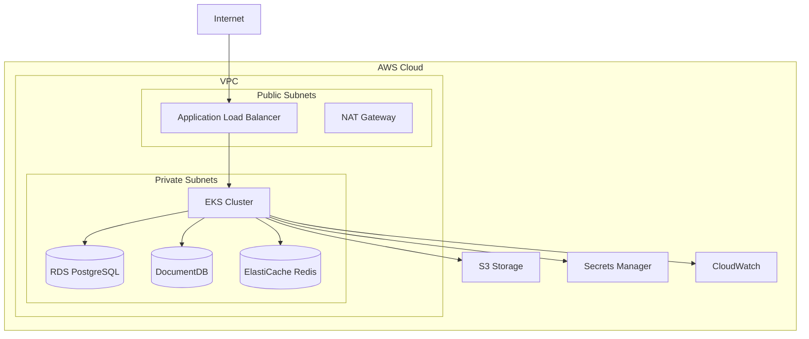

# 🏗️ АРХИТЕКТУРА СИСТЕМЫ
## Bybit Trading Bot - Детальная техническая архитектура

**Дата:** 2025-08-27 16:45:00  
**Версия:** 1.0

---

## 🎯 АРХИТЕКТУРНЫЕ ПРИНЦИПЫ

### 🔧 **Основные принципы дизайна**
- **Microservices Architecture** - независимые, слабо связанные сервисы
- **Event-Driven Design** - асинхронная обработка через события
- **Domain-Driven Design** - четкое разделение бизнес-доменов
- **CQRS + Event Sourcing** - разделение команд и запросов
- **Cloud-Native** - готовность к развертыванию в облаке

### 📊 **Качественные атрибуты**
- **Scalability** - горизонтальное масштабирование
- **Reliability** - отказоустойчивость и восстановление
- **Performance** - низкая latency для торговых операций
- **Security** - защита данных и соответствие требованиям
- **Maintainability** - простота разработки и поддержки

---

## 🏛️ ВЫСОКОУРОВНЕВАЯ АРХИТЕКТУРА

### 🌐 **Системная диаграмма**



---

## 🔧 МИКРОСЕРВИСЫ ДЕТАЛИЗАЦИЯ

### 🎯 **Core Business Services**

#### 1. **Decision Engine Service**
- **Назначение:** Центральный алгоритм принятия торговых решений
- **Технологии:** Node.js, TypeScript, TensorFlow.js
- **Порт:** 3001
- **База данных:** PostgreSQL (decisions), Redis (cache)

**Ключевые компоненты:**
```typescript
interface DecisionEngine {
  riskFilter: RiskFilterModule;
  mlEngine: MLPatternEngine;
  ruleEngine: ExpertRuleEngine;
  adaptiveCombiner: AdaptiveCombiner;
  performanceTracker: PerformanceTracker;
  
  makeDecision(signals: MarketSignals): Promise<TradingDecision>;
}
```

**Входящие события:**
- `technical.signal.generated`
- `fundamental.signal.generated`
- `macro.signal.generated`
- `risk.limit.updated`

**Исходящие события:**
- `trading.decision.made`
- `trading.signal.confirmed`
- `trading.signal.rejected`

#### 2. **Trading Service**
- **Назначение:** Выполнение торговых операций на Bybit
- **Технологии:** Node.js, TypeScript, CCXT
- **Порт:** 3002
- **База данных:** PostgreSQL (orders, trades)

**API интеграции:**
```typescript
interface TradingService {
  executeOrder(order: TradingOrder): Promise<ExecutionResult>;
  cancelOrder(orderId: string): Promise<CancelResult>;
  getPositions(): Promise<Position[]>;
  getOrderStatus(orderId: string): Promise<OrderStatus>;
}
```

#### 3. **Risk Service**
- **Назначение:** Управление рисками и compliance
- **Технологии:** Node.js, TypeScript
- **Порт:** 3003
- **База данных:** PostgreSQL (risk_rules, violations)

**Risk правила:**
```typescript
interface RiskRules {
  maxPositionSize: number;
  maxDailyLoss: number;
  maxDrawdown: number;
  correlationLimits: CorrelationRule[];
  volatilityAdjustments: VolatilityRule[];
}
```

### 📊 **Data Collection Services**

#### 4. **Market Data Service**
- **Назначение:** Сбор и нормализация рыночных данных
- **Технологии:** Node.js, TypeScript, WebSocket
- **Порт:** 3005
- **База данных:** MongoDB (time_series), Redis (real_time)

**Data Pipeline:**
```typescript
interface MarketDataPipeline {
  collectors: DataCollector[];
  normalizers: DataNormalizer[];
  validators: DataValidator[];
  publishers: EventPublisher[];
  
  processMarketData(rawData: RawMarketData): Promise<void>;
}
```

#### 5. **News Service**
- **Назначение:** Агрегация и анализ новостей
- **Технологии:** Node.js, TypeScript, NLP libraries
- **Порт:** 3006
- **База данных:** MongoDB (news_articles, sentiment)

**News Processing:**
```typescript
interface NewsProcessor {
  aggregators: NewsAggregator[];
  sentimentAnalyzer: SentimentAnalyzer;
  relevanceFilter: RelevanceFilter;
  publisher: EventPublisher;
  
  processNews(article: NewsArticle): Promise<ProcessedNews>;
}
```

### 🧠 **Analysis Services**

#### 6. **Technical Analysis Service**
- **Назначение:** Расчет технических индикаторов
- **Технологии:** Node.js, TypeScript, TechnicalIndicators
- **Порт:** 3008
- **База данных:** MongoDB (indicators), Redis (cache)

**Индикаторы:**
```typescript
interface TechnicalIndicators {
  momentum: MomentumIndicator;
  rsi: RSIIndicator;
  macd: MACDIndicator;
  bollingerBands: BollingerBandsIndicator;
  movingAverages: MovingAveragesIndicator;
  // ... +12 дополнительных индикаторов
  
  calculateAll(priceData: PriceData): Promise<IndicatorResults>;
}
```

#### 7. **ML Analysis Service**
- **Назначение:** Машинное обучение и предсказания
- **Технологии:** Python, TensorFlow, FastAPI
- **Порт:** 3010
- **База данных:** MongoDB (models, predictions)

**ML Models:**
```python
class MLAnalysisService:
    lstm_model: LSTMPricePredictor
    random_forest: PatternClassifier
    feature_engineer: FeatureEngineer
    model_trainer: ModelTrainer
    
    async def predict_price_movement(
        self, 
        market_data: MarketData
    ) -> PredictionResult
```

### 🔧 **Infrastructure Services**

#### 8. **API Gateway**
- **Назначение:** Единая точка входа, маршрутизация, аутентификация
- **Технологии:** Node.js, Express, JWT
- **Порт:** 3000

**Middleware Stack:**
```typescript
interface APIGateway {
  rateLimiter: RateLimitMiddleware;
  authenticator: JWTAuthMiddleware;
  authorizer: RBACMiddleware;
  logger: RequestLoggerMiddleware;
  router: ServiceRouter;
}
```

#### 9. **Config Service**
- **Назначение:** Централизованное управление конфигурацией
- **Технологии:** Node.js, TypeScript, etcd
- **Порт:** 3013

---

## 💾 АРХИТЕКТУРА ДАННЫХ

### 🗄️ **Database Architecture**

#### **PostgreSQL - Транзакционные данные**
```
📊 Database per Service:
├── auth_db          # Пользователи, роли, сессии
├── trading_db       # Ордера, сделки, позиции
├── portfolio_db     # Портфели, балансы, P&L
└── risk_db          # Риск-правила, нарушения
```

#### **MongoDB - Документы и временные ряды**
```
�� Collections:
├── market_data      # OHLCV данные по парам
├── news_articles    # Новости и sentiment
├── indicators       # Технические индикаторы
├── ml_models        # ML модели и предсказания
└── system_logs      # Логи и события
```

#### **Redis - Кэш и реал-тайм данные**
```
📊 Data Structures:
├── sessions:*       # Пользовательские сессии
├── prices:*         # Текущие цены (TTL 60s)
├── signals:*        # Торговые сигналы (TTL 300s)
├── cache:*          # Кэшированные вычисления
└── pubsub           # Event streaming
```

### 🔄 **Event-Driven Architecture**

#### **Event Flow:**


#### **Event Types:**
```typescript
interface SystemEvents {
  // Market Data Events
  'market.data.updated': MarketDataEvent;
  'market.data.error': ErrorEvent;
  
  // Analysis Events
  'technical.signal.generated': TechnicalSignalEvent;
  'fundamental.signal.generated': FundamentalSignalEvent;
  'ml.prediction.ready': MLPredictionEvent;
  
  // Trading Events
  'trading.decision.made': TradingDecisionEvent;
  'order.created': OrderCreatedEvent;
  'order.executed': OrderExecutedEvent;
  'position.updated': PositionUpdatedEvent;
  
  // Risk Events
  'risk.limit.exceeded': RiskLimitEvent;
  'risk.check.failed': RiskCheckEvent;
}
```

---

## 🔒 БЕЗОПАСНОСТЬ АРХИТЕКТУРЫ

### 🛡️ **Security Layers**

#### **1. Perimeter Security**
- **WAF (Web Application Firewall)** - защита от OWASP Top 10
- **DDoS Protection** - Cloudflare или AWS Shield
- **VPN Access** - для административного доступа
- **IP Whitelisting** - ограничение доступа по IP

#### **2. Application Security**
- **JWT Authentication** - stateless токены с ротацией
- **RBAC Authorization** - role-based access control
- **API Rate Limiting** - защита от abuse
- **Input Validation** - валидация всех входных данных

#### **3. Data Security**
- **Encryption at Rest** - AES-256 для sensitive данных
- **Encryption in Transit** - TLS 1.3 для всех соединений
- **Key Management** - AWS KMS или HashiCorp Vault
- **Database Security** - row-level security, audit logs

#### **4. Network Security**


---

## 📊 МОНИТОРИНГ И OBSERVABILITY

### 🔍 **Three Pillars of Observability**

#### **1. Metrics (Prometheus + Grafana)**
```yaml
Business Metrics:
  - trading_decisions_per_minute
  - order_execution_latency
  - portfolio_pnl_realtime
  - risk_violations_count

Technical Metrics:
  - service_response_time
  - database_connection_pool
  - memory_usage_percent
  - cpu_utilization
```

#### **2. Logs (ELK Stack)**
```json
{
  "timestamp": "2025-08-27T16:45:00Z",
  "service": "decision-engine",
  "level": "INFO",
  "trade_id": "trade_123",
  "message": "Trading decision made",
  "metadata": {
    "symbol": "BTCUSDT",
    "action": "BUY",
    "confidence": 0.87,
    "signals": ["rsi_oversold", "macd_bullish"]
  }
}
```

#### **3. Traces (Jaeger)**
- **Distributed tracing** для request flow
- **Performance bottleneck detection**
- **Error propagation analysis**
- **Service dependency mapping**

### 📈 **Health Checks & SLA**

#### **Service Health Endpoints:**
```typescript
interface HealthCheck {
  status: 'healthy' | 'degraded' | 'unhealthy';
  timestamp: string;
  version: string;
  dependencies: {
    database: HealthStatus;
    external_apis: HealthStatus;
    message_queue: HealthStatus;
  };
  metrics: {
    response_time: number;
    error_rate: number;
    throughput: number;
  };
}
```

#### **SLA Targets:**
- **Uptime:** 99.9% (8.76 часов downtime/год)
- **Response Time:** P95 < 100ms для trading operations
- **Throughput:** 1000+ requests/second
- **Data Freshness:** Market data delay < 50ms

---

## 🚀 DEPLOYMENT АРХИТЕКТУРА

### 🐳 **Container Orchestration**

#### **Docker Compose (Development)**
```yaml
version: '3.8'
services:
  api-gateway:
    build: ./services/api-gateway
    ports: ["3000:3000"]
    depends_on: [postgres, redis]
    
  decision-engine:
    build: ./services/decision-engine
    ports: ["3001:3001"]
    depends_on: [postgres, kafka]
    
  # ... остальные сервисы
```

#### **Kubernetes (Production)**
```yaml
apiVersion: apps/v1
kind: Deployment
metadata:
  name: decision-engine
spec:
  replicas: 3
  selector:
    matchLabels:
      app: decision-engine
  template:
    spec:
      containers:
      - name: decision-engine
        image: trading-bot/decision-engine:latest
        resources:
          requests:
            memory: "256Mi"
            cpu: "250m"
          limits:
            memory: "512Mi"
            cpu: "500m"
```

### ☁️ **Cloud Architecture (AWS)**


---

## 📋 АРХИТЕКТУРНЫЕ РЕШЕНИЯ И TRADE-OFFS

### ✅ **Выбранные паттерны и обоснование**

#### **Microservices vs Monolith**
- **Выбор:** Microservices
- **Обоснование:** Независимое масштабирование, technology diversity, team autonomy
- **Trade-offs:** Complexity в deployment, network latency, distributed system challenges

#### **Event-Driven vs Request-Response**
- **Выбор:** Hybrid (Event-driven для business logic, Request-response для queries)
- **Обоснование:** Loose coupling, scalability, eventual consistency tolerance
- **Trade-offs:** Debugging complexity, message ordering challenges

#### **SQL vs NoSQL**
- **Выбор:** Polyglot persistence (PostgreSQL + MongoDB + Redis)
- **Обоснование:** Right tool for right data, performance optimization
- **Trade-offs:** Operational complexity, data consistency challenges

### ⚖️ **Architecture Quality Attributes**

| Качество | Приоритет | Архитектурное решение | Метрика |
|----------|-----------|----------------------|---------|
| **Performance** | Высокий | Caching, async processing | < 100ms latency |
| **Scalability** | Высокий | Microservices, horizontal scaling | 10x traffic growth |
| **Reliability** | Критический | Circuit breakers, redundancy | 99.9% uptime |
| **Security** | Критический | Defense in depth, encryption | 0 security incidents |
| **Maintainability** | Средний | Clean architecture, documentation | < 2 weeks feature delivery |

---

**🏗️ Данная архитектура обеспечивает баланс между производительностью, надежностью и maintainability для высоконагруженной торговой системы.**
