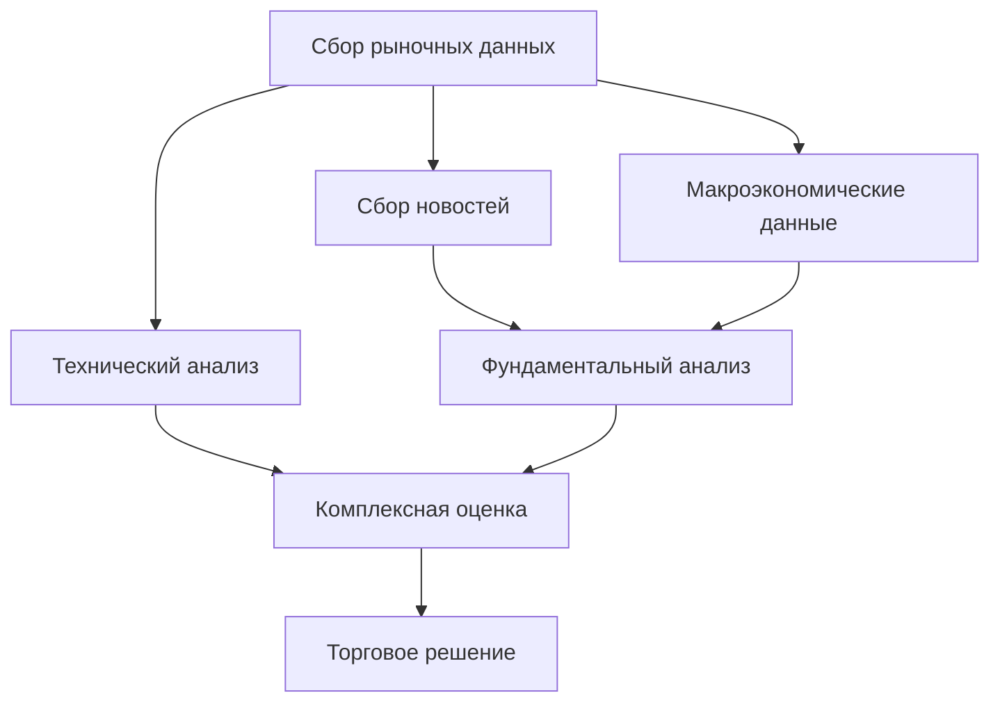
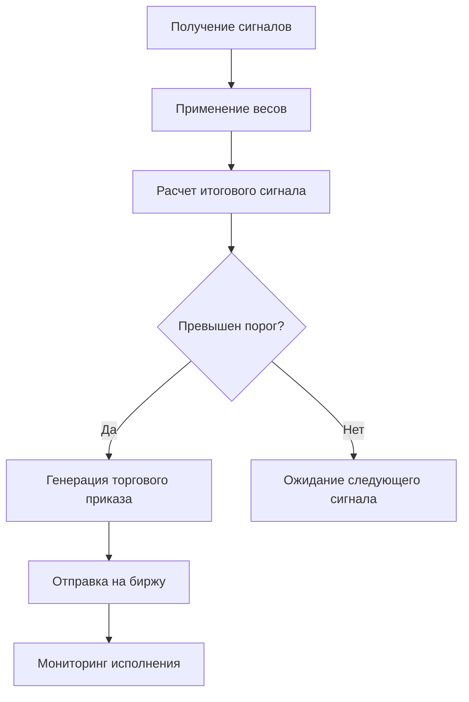
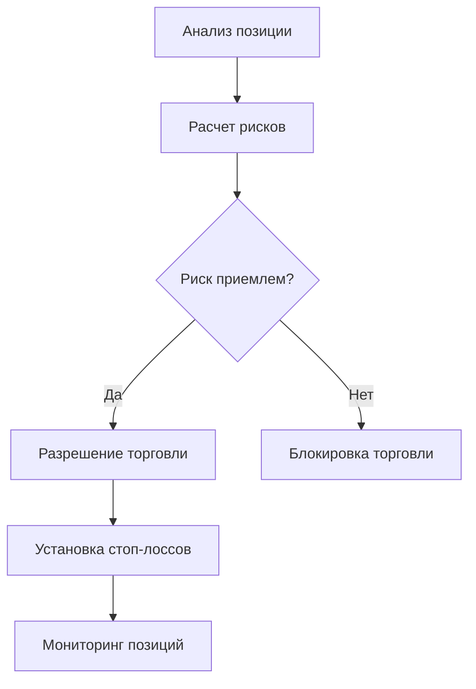

# ПРОДУКТОВЫЙ КОНТЕКСТ ПРОЕКТА

## БИЗНЕС-ЦЕЛИ И ЗАДАЧИ

### Основная цель проекта
Создание автоматизированной торговой системы для криптовалютного рынка, способной принимать обоснованные торговые решения на основе комплексного анализа множественных факторов.

### Ключевые бизнес-задачи
1. **Автоматизация торговли**: Исключение эмоционального фактора из торговых решений
2. **Масштабируемость**: Возможность одновременной торговли несколькими активами
3. **Консистентность**: Постоянное применение торговой стратегии без отклонений
4. **Эффективность**: Минимизация времени реакции на рыночные изменения
5. **Аналитика**: Детальное отслеживание результатов и корректировка стратегий

## КЛЮЧЕВЫЕ ЗАИНТЕРЕСОВАННЫЕ СТОРОНЫ

### Основные пользователи
- **Частные инвесторы**: Физические лица, торгующие криптовалютами
- **Трейдеры**: Профессиональные трейдеры, ищущие автоматизацию
- **Криптофонды**: Управляющие компании для работы с цифровыми активами

### Технические стейкхолдеры
- **Системные администраторы**: Ответственные за инфраструктуру
- **Разработчики**: Команда разработки и поддержки
- **Аналитики**: Специалисты по торговым стратегиям

### Внешние стороны
- **Регуляторы**: Финансовые надзорные органы
- **Провайдеры данных**: API источники рыночных данных
- **Биржи**: Криптовалютные торговые площадки

## БИЗНЕС-ПРОЦЕССЫ

### 1. Сбор и анализ данных

### 2. Принятие торговых решений

### 3. Управление рисками

## БИЗНЕС-ОГРАНИЧЕНИЯ

### Финансовые ограничения
- **Бюджет разработки**: Ограниченные средства на создание системы
- **Операционные расходы**: Стоимость серверов, API подписок
- **Капитал для торговли**: Ограниченный размер торгового капитала

### Регуляторные ограничения
- **Лицензирование**: Требования к лицензиям в различных юрисдикциях
- **KYC/AML**: Соблюдение требований по идентификации клиентов
- **Налогообложение**: Учет налоговых обязательств по торговым операциям

### Технические ограничения
- **Латентность**: Ограничения скорости реакции на рыночные изменения
- **Пропускная способность**: Лимиты API вызовов к внешним сервисам
- **Надежность**: Требования к uptime и отказоустойчивости

### Рыночные ограничения
- **Ликвидность**: Ограничения на размер позиций для некоторых активов
- **Волатильность**: Экстремальные рыночные условия
- **Корреляции**: Изменение исторических корреляций между активами

## КЛЮЧЕВЫЕ МЕТРИКИ БИЗНЕСА

### Финансовые показатели
- **ROI (Return on Investment)**: Целевая доходность > 15% годовых
- **Максимальная просадка**: Не более 10% от капитала
- **Sharpe Ratio**: Соотношение доходности к риску > 1.5
- **Win Rate**: Процент прибыльных сделок > 60%

### Операционные показатели
- **Uptime системы**: > 99.5%
- **Латентность торговых сигналов**: < 100ms
- **Точность прогнозов**: > 70% корректных сигналов
- **Объем обработанных данных**: Все доступные источники в реальном времени

### Пользовательские показатели
- **Удовлетворенность пользователей**: > 4.5/5
- **Время настройки системы**: < 30 минут
- **Количество поддерживаемых активов**: Минимум 3 (BTC, ETH, SOL)
- **Частота обновления стратегий**: Ежемесячно

## БИЗНЕС-РИСКИ

### Критические риски
- **Потеря торгового капитала**: Некорректная работа алгоритмов
  - **Вероятность**: Средняя | **Влияние**: Критическое
  - **Митигация**: Тщательное тестирование, ограничение размера позиций

- **Регуляторные изменения**: Запрет/ограничение алготрейдинга
  - **Вероятность**: Низкая | **Влияние**: Критическое
  - **Митигация**: Мониторинг законодательства, адаптация к требованиям

### Высокие риски
- **Технический сбой системы**: Отказ критических компонентов
  - **Митигация**: Резервирование, мониторинг, быстрое восстановление

- **Изменение рыночных условий**: Стратегия перестает работать
  - **Митигация**: Адаптивные алгоритмы, регулярное обновление

- **Кибербезопасность**: Атаки на торговые ключи
  - **Митигация**: Многоуровневая защита, регулярные аудиты

## ТРЕБОВАНИЯ К ПРОДУКТУ

### Функциональные требования
1. **Автоматическая торговля**: Полностью автоматическое исполнение сделок
2. **Мультиактивность**: Одновременная торговля несколькими криптовалютами
3. **Настраиваемость**: Возможность корректировки параметров стратегий
4. **Мониторинг**: Реал-тайм отслеживание позиций и результатов
5. **Бэктестирование**: Проверка стратегий на исторических данных

### Нефункциональные требования
1. **Производительность**: Обработка сигналов в реальном времени
2. **Надежность**: Работа 24/7 без критических сбоев
3. **Безопасность**: Защита торговых ключей и персональных данных
4. **Масштабируемость**: Возможность добавления новых активов и источников
5. **Удобство**: Интуитивный интерфейс управления

## КОНКУРЕНТНОЕ ОКРУЖЕНИЕ

### Прямые конкуренты
- **3Commas**: Автоматизация торговли с простыми стратегиями
- **TradeSanta**: Боты для криптотрейдинга с базовым функционалом
- **Cryptohopper**: Облачная платформа для алготрейдинга
- **Pionex**: Биржа со встроенными торговыми ботами

### Конкурентные преимущества
1. **Комплексный анализ**: Интеграция 40+ факторов принятия решений
2. **Адаптивность**: ML-алгоритмы для улучшения стратегий
3. **Прозрачность**: Полное понимание логики принятия решений
4. **Настраиваемость**: Гибкая система весов и параметров

## ПЛАН МОНЕТИЗАЦИИ

### Варианты монетизации
1. **SaaS подписка**: Ежемесячная плата за использование
2. **Комиссия с прибыли**: Процент от успешных торговых операций
3. **Лицензирование**: Продажа лицензий институциональным клиентам
4. **Консалтинг**: Настройка персональных торговых стратегий

### Целевые сегменты
- **Retail трейдеры**: $50-200/месяц
- **Профессиональные трейдеры**: $500-2000/месяц  
- **Институциональные клиенты**: $5000-50000/месяц

## ДОРОЖНАЯ КАРТА ПРОДУКТА

### Фаза 1: MVP (3-6 месяцев)
- Базовая торговая система
- 3 основных актива (BTC, ETH, SOL)
- Ключевые технические индикаторы
- Простой интерфейс управления

### Фаза 2: Расширение (6-12 месяцев)
- Полная интеграция всех источников данных
- ML-модели для прогнозирования
- Расширенная аналитика
- Мобильное приложение

### Фаза 3: Масштабирование (12-24 месяца)
- Поддержка всех основных криптовалют
- API для интеграции с внешними системами
- Институциональные функции
- Международная экспансия

## КРИТЕРИИ УСПЕХА

### Краткосрочные (3-6 месяцев)
- [ ] Рабочий MVP с базовой торговой логикой
- [ ] Положительные результаты бэктестирования
- [ ] Привлечение первых 10 пользователей

### Среднесрочные (6-18 месяцев)
- [ ] 100+ активных пользователей
- [ ] Средняя доходность > 15% годовых
- [ ] Автономная работа системы 99.5% времени

### Долгосрочные (18+ месяцев)
- [ ] 1000+ активных пользователей
- [ ] Прибыльность проекта
- [ ] Выход на международные рынки

## ОБНОВЛЕНО
2025-08-27 17:10:00
