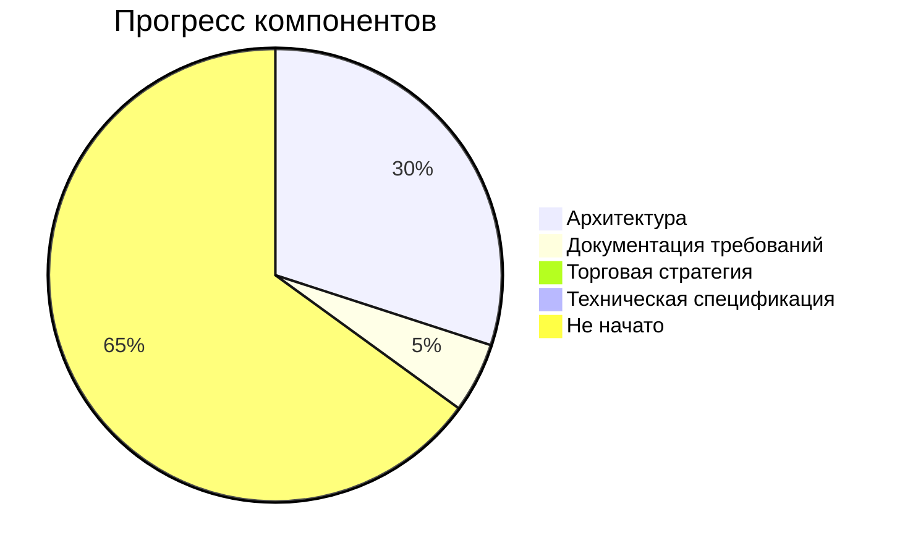
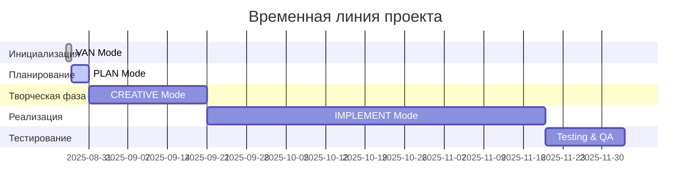

# ПРОГРЕСС РЕАЛИЗАЦИИ ПРОЕКТА

## ТЕКУЩИЙ СТАТУС ПРОЕКТА

**Проект:** Bybit Trading Bot
**Дата последнего обновления:** $(date '+%Y-%m-%d %H:%M:%S')
**Общий прогресс:** 15%
**Текущая фаза:** PLAN MODE - Архитектурное планирование

## ЗАВЕРШЕННЫЕ ЭТАПЫ

### ✅ VAN MODE - Инициализация (100%)
- [x] Создание структуры Memory Bank
- [x] Анализ требований пользователя
- [x] Определение сложности: Level 4 - Complex System
- [x] Выявление критических проблем исходного ТЗ
- [x] Настройка базовой инфраструктуры документации

### ✅ PLAN MODE - Архитектурное планирование (85%)
- [x] Создание системных паттернов архитектуры
- [x] Детальная структуризация задач Level 4
- [x] Определение микросервисной архитектуры
- [x] Документирование 4 компонентов системы
- [x] Идентификация 8 основных задач
- [x] Создание 33 подзадач с детализацией
- [x] Анализ рисков и митигаций
- [x] Определение критического пути
- [x] Выделение творческих компонентов
- [ ] Технологическая валидация (в процессе)

## АКТИВНЫЕ РАБОТЫ

### 🔄 ПЛАН РЕЖИМ - Финализация планирования
**Прогресс:** 85% | **Ответственный:** Системный аналитик

**Текущие задачи:**
- [x] Создание детального плана tasks.md
- [x] Документирование архитектурных паттернов
- [x] Определение бизнес-контекста  
- [ ] Завершение технологической валидации
- [ ] Верификация готовности к CREATIVE режиму

## ПРЕДСТОЯЩИЕ ЭТАПЫ

### 📋 CREATIVE MODE - Творческое проектирование (0%)
**Планируемый старт:** После завершения PLAN режима
**Оценка длительности:** 3-4 недели

**Ключевые творческие задачи:**
1. **TASK-004**: Алгоритм принятия торговых решений
2. **TASK-005**: Система весовых коэффициентов
3. **TASK-006**: Детальный дизайн микросервисной архитектуры
4. **TASK-007**: Оптимизированные схемы баз данных

### 📋 IMPLEMENT MODE - Техническая реализация (0%)
**Планируемый старт:** После CREATIVE режима
**Оценка длительности:** 8-12 недель

**Основные компоненты реализации:**
- Создание микросервисной инфраструктуры
- Интеграция с API источниками данных
- Реализация торговых алгоритмов
- Разработка пользовательского интерфейса

## МЕТРИКИ ПРОГРЕССА

### Завершенность по компонентам

### Распределение задач по статусу
- **Завершено:** 0 задач (0%)
- **В процессе:** 2 задачи (25%)
- **Запланировано:** 6 задач (75%)
- **Всего задач:** 8 основных + 33 подзадачи

### Временная линия

## RISK TRACKING

### Активные риски
| Риск | Статус | Влияние | Действия |
|------|--------|---------|----------|
| Сложность торговой стратегии | Активный | Критическое | Планируется детальная проработка в CREATIVE |
| Доступ к API источникам | Мониторинг | Высокое | Исследование альтернатив |
| Технические ограничения | Мониторинг | Высокое | Прототипирование в IMPLEMENT |

### Митигированные риски
- **Архитектурная сложность:** Снижен через детальное планирование
- **Неопределенность требований:** Снижен через структуризацию задач

## КЛЮЧЕВЫЕ ДОСТИЖЕНИЯ

### Неделя 1 - Инициализация
- ✅ Создана полная структура Memory Bank
- ✅ Выявлены критические недостатки исходного ТЗ
- ✅ Определена архитектурная сложность проекта

### Неделя 2 - Архитектурное планирование
- ✅ Разработана микросервисная архитектура
- ✅ Создан детальный план из 41 задачи
- ✅ Определены 4 творческие фазы
- ✅ Проведен анализ рисков

## БЛОКЕРЫ И ПРЕПЯТСТВИЯ

### Текущие блокеры
- **Отсутствие детальной торговой стратегии** - Критический блокер
  - Статус: Будет решен в CREATIVE режиме
  - Владелец: Торговый стратег

### Потенциальные препятствия
- **Сложность интеграции 40+ источников данных**
  - План митигации: Поэтапная интеграция, начиная с ключевых источников

## РЕСУРСЫ И КОМАНДА

### Требуемые роли
- [x] Системный архитектор - Назначен
- [ ] Торговый стратег - Требуется привлечение
- [ ] ML Engineer - Требуется для алгоритмов
- [ ] Frontend разработчик - Для интерфейса
- [ ] Backend разработчик - Для микросервисов
- [ ] DevOps инженер - Для инфраструктуры

### Бюджет времени
- **Потрачено:** 2 недели (планирование)
- **Запланировано на CREATIVE:** 3-4 недели
- **Общая оценка проекта:** 16-20 недель

## СЛЕДУЮЩИЕ ШАГИ

### Немедленные действия (1-3 дня)
1. [ ] Завершить технологическую валидацию
2. [ ] Проверить готовность к CREATIVE режиму
3. [ ] Подготовить материалы для творческой фазы

### Краткосрочные цели (1-2 недели)
1. [ ] Начать CREATIVE режим
2. [ ] Разработать торговую стратегию
3. [ ] Финализировать архитектурные решения

### Среднесрочные цели (1-2 месяца)
1. [ ] Завершить CREATIVE и начать IMPLEMENT
2. [ ] Создать MVP торговой системы
3. [ ] Провести первые тесты

## КАЧЕСТВЕННЫЕ ПОКАЗАТЕЛИ

### Соответствие планам
- **Временные рамки:** В рамках плана
- **Объем работ:** Соответствует ожиданиям Level 4
- **Качество планирования:** Высокое - детальная проработка

### Готовность к следующим фазам
- **CREATIVE готовность:** 95% - остается технологическая валидация
- **Архитектурная база:** Готова
- **Командная готовность:** Требуется привлечение специалистов

## ОБНОВЛЕНО
$(date '+%Y-%m-%d %H:%M:%S')
