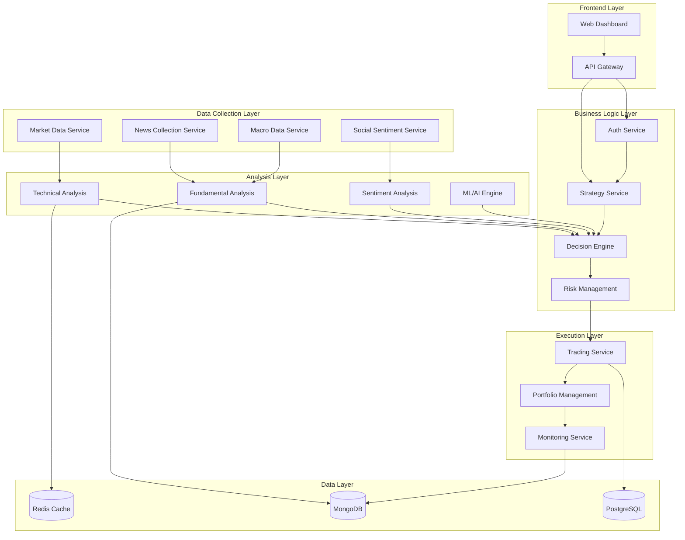

# СИСТЕМНЫЕ ПАТТЕРНЫ И АРХИТЕКТУРА

## АРХИТЕКТУРНЫЙ СТИЛЬ
**Microservices + Event-Driven Architecture**

### ОБОСНОВАНИЕ ВЫБОРА
- **Масштабируемость:** Различные компоненты (торговля, анализ данных, новости) могут масштабироваться независимо
- **Отказоустойчивость:** Сбой одного сервиса не останавливает всю систему
- **Гибкость:** Возможность замены/улучшения отдельных компонентов
- **Разделение ответственности:** Каждый сервис решает конкретную задачу

## КЛЮЧЕВЫЕ АРХИТЕКТУРНЫЕ ПРИНЦИПЫ

### 1. Разделение ответственности (SoC)
- **Сбор данных** отделен от **анализа**
- **Анализ** отделен от **принятия решений**
- **Принятие решений** отделено от **исполнения торгов**

### 2. Асинхронная обработка
- Использование очередей сообщений (Redis Pub/Sub)
- Event-driven архитектура для координации между сервисами
- Неблокирующая обработка данных

### 3. Многоуровневая безопасность
- Изоляция торговых ключей в отдельном сервисе
- Мультифакторная аутентификация для доступа
- Шифрование всех финансовых данных

### 4. Компенсирующие транзакции
- Система отката торговых операций
- Логирование всех действий для аудита
- Механизмы восстановления после сбоев

## КОМПОНЕНТНАЯ АРХИТЕКТУРА



## ПАТТЕРНЫ РЕАЛИЗАЦИИ

### 1. Circuit Breaker Pattern
**Применение:** Защита от сбоев внешних API
**Реализация:** Hystrix или подобные библиотеки
**Цель:** Предотвращение каскадных сбоев

### 2. Saga Pattern  
**Применение:** Управление распределенными транзакциями
**Реализация:** Оркестрация через центральный координатор
**Цель:** Обеспечение консистентности данных

### 3. CQRS (Command Query Responsibility Segregation)
**Применение:** Разделение операций чтения и записи
**Реализация:** Отдельные модели для команд и запросов
**Цель:** Оптимизация производительности

### 4. Event Sourcing
**Применение:** Хранение истории всех торговых событий
**Реализация:** Последовательность неизменяемых событий
**Цель:** Полная прослеживаемость и возможность воспроизведения

## ТЕХНОЛОГИЧЕСКИЙ СТЕК

### Frontend
- **Framework:** Next.js 14
- **UI Library:** Material-UI или Ant Design
- **State Management:** Redux Toolkit + RTK Query
- **Charts:** TradingView Charting Library

### Backend Services
- **Framework:** Nest.js
- **Communication:** gRPC между сервисами, GraphQL для frontend
- **Message Queue:** Redis Pub/Sub + Bull Queue
- **Caching:** Redis

### Databases
- **Time Series:** MongoDB (для рыночных данных)
- **Relational:** PostgreSQL + Prisma (конфигурация, пользователи)
- **Cache:** Redis (быстрый доступ к часто используемым данным)

### Infrastructure
- **Containerization:** Docker + Docker Compose
- **Orchestration:** Kubernetes (для production)
- **Monitoring:** Prometheus + Grafana
- **Logging:** ELK Stack (Elasticsearch, Logstash, Kibana)

## ИНТЕГРАЦИОННЫЕ ПАТТЕРНЫ

### 1. API Gateway Pattern
- Единая точка входа для всех клиентских запросов
- Маршрутизация к соответствующим микросервисам
- Аутентификация и авторизация
- Rate limiting и throttling

### 2. Database per Service
- Каждый микросервис имеет собственную БД
- Исключение прямого доступа к БД других сервисов
- Обмен данными только через API

### 3. Shared Data Anti-Pattern Avoidance
- Избегание совместного использования схем БД
- Использование событий для синхронизации данных
- Eventual consistency между сервисами

## ПАТТЕРНЫ БЕЗОПАСНОСТИ

### 1. Least Privilege Principle
- Минимальные права доступа для каждого компонента
- Разделение торговых и аналитических ключей
- Временные токены для API доступа

### 2. Defense in Depth
- Множественные уровни защиты
- WAF + API Gateway + Service Level Security
- Шифрование данных в покое и в движении

### 3. Secure by Design
- Безопасность встроена в архитектуру
- Валидация входных данных на всех уровнях
- Аудит всех операций

## ПАТТЕРНЫ ДАННЫХ

### 1. Time Series Optimization
- Специализированные схемы для временных рядов
- Партиционирование по времени
- Автоматическая архивация старых данных

### 2. Real-time Data Pipeline
- Streaming обработка рыночных данных
- Низкая латентность для торговых сигналов
- Backpressure handling для пиковых нагрузок

### 3. Data Lake Pattern
- Централизованное хранение сырых данных
- ETL процессы для аналитики
- Machine Learning pipeline

## ОБНОВЛЕНО
$(date '+%Y-%m-%d %H:%M:%S')

## ПАТТЕРН ДОКУМЕНТИРОВАНИЯ FILE REFERENCES

### ОБЯЗАТЕЛЬНОЕ ТРЕБОВАНИЕ ДЛЯ ВСЕХ ЗАДАЧ
**Дата внедрения:** $(date '+%Y-%m-%d %H:%M:%S')

Все задачи в tasks.md и других документах мемори-банка ДОЛЖНЫ содержать секцию **FILE REFERENCES** с полными путями к файлам.

### СТРУКТУРА FILE REFERENCES
```markdown
## FILE REFERENCES
### Созданные файлы:
- `/полный/путь/к/файлу.ext` - назначение и описание файла

### Модифицированные файлы:
- `/полный/путь/к/файлу.ext` - описание внесенных изменений

### Связанные файлы:
- `/полный/путь/к/файлу.ext` - описание связи с задачей
```

### ПРИМЕНЕНИЕ В WORKFLOW
1. **VAN MODE:** File references для анализируемых файлов
2. **PLAN MODE:** File references для планируемых к созданию файлов  
3. **CREATIVE MODE:** File references для созданной документации
4. **IMPLEMENT MODE:** File references для всех создаваемых файлов кода
5. **REFLECT MODE:** File references для анализируемых результатов
6. **ARCHIVE MODE:** File references для архивируемых материалов

### ИНТЕГРАЦИЯ С GIT WORKFLOW
File references должны соответствовать структуре git репозитория:
- Использовать относительные пути от корня репозитория
- Указывать актуальные имена файлов
- Обновлять при переименовании/перемещении файлов

### СИСТЕМНОЕ ТРЕБОВАНИЕ
Начиная с данного момента, ЛЮБАЯ задача без корректных file references считается **НЕПОЛНОЙ** и должна быть дополнена перед закрытием.

**Ответственность:** Каждый участник команды обязан включать file references в свои задачи.
