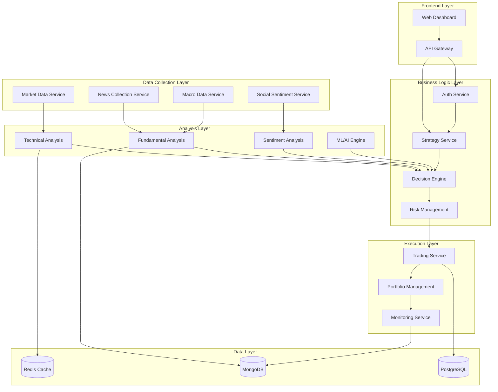

# СИСТЕМНЫЕ ПАТТЕРНЫ И АРХИТЕКТУРА

## АРХИТЕКТУРНЫЙ СТИЛЬ
**Microservices + Event-Driven Architecture**

### ОБОСНОВАНИЕ ВЫБОРА
- **Масштабируемость:** Различные компоненты (торговля, анализ данных, новости) могут масштабироваться независимо
- **Отказоустойчивость:** Сбой одного сервиса не останавливает всю систему
- **Гибкость:** Возможность замены/улучшения отдельных компонентов
- **Разделение ответственности:** Каждый сервис решает конкретную задачу

## КЛЮЧЕВЫЕ АРХИТЕКТУРНЫЕ ПРИНЦИПЫ

### 1. Разделение ответственности (SoC)
- **Сбор данных** отделен от **анализа**
- **Анализ** отделен от **принятия решений**
- **Принятие решений** отделено от **исполнения торгов**

### 2. Асинхронная обработка
- Использование очередей сообщений (Redis Pub/Sub)
- Event-driven архитектура для координации между сервисами
- Неблокирующая обработка данных

### 3. Многоуровневая безопасность
- Изоляция торговых ключей в отдельном сервисе
- Мультифакторная аутентификация для доступа
- Шифрование всех финансовых данных

### 4. Компенсирующие транзакции
- Система отката торговых операций
- Логирование всех действий для аудита
- Механизмы восстановления после сбоев

## КОМПОНЕНТНАЯ АРХИТЕКТУРА



## ПАТТЕРНЫ РЕАЛИЗАЦИИ

### 1. Circuit Breaker Pattern
**Применение:** Защита от сбоев внешних API
**Реализация:** Hystrix или подобные библиотеки
**Цель:** Предотвращение каскадных сбоев

### 2. Saga Pattern  
**Применение:** Управление распределенными транзакциями
**Реализация:** Оркестрация через центральный координатор
**Цель:** Обеспечение консистентности данных

### 3. CQRS (Command Query Responsibility Segregation)
**Применение:** Разделение операций чтения и записи
**Реализация:** Отдельные модели для команд и запросов
**Цель:** Оптимизация производительности

### 4. Event Sourcing
**Применение:** Хранение истории всех торговых событий
**Реализация:** Последовательность неизменяемых событий
**Цель:** Полная прослеживаемость и возможность воспроизведения

## ТЕХНОЛОГИЧЕСКИЙ СТЕК

### Frontend
- **Framework:** Next.js 14
- **UI Library:** Material-UI или Ant Design
- **State Management:** Redux Toolkit + RTK Query
- **Charts:** TradingView Charting Library

### Backend Services
- **Framework:** Nest.js
- **Communication:** gRPC между сервисами, GraphQL для frontend
- **Message Queue:** Redis Pub/Sub + Bull Queue
- **Caching:** Redis

### Databases
- **Time Series:** MongoDB (для рыночных данных)
- **Relational:** PostgreSQL + Prisma (конфигурация, пользователи)
- **Cache:** Redis (быстрый доступ к часто используемым данным)

### Infrastructure
- **Containerization:** Docker + Docker Compose
- **Orchestration:** Kubernetes (для production)
- **Monitoring:** Prometheus + Grafana
- **Logging:** ELK Stack (Elasticsearch, Logstash, Kibana)

## ИНТЕГРАЦИОННЫЕ ПАТТЕРНЫ

### 1. API Gateway Pattern
- Единая точка входа для всех клиентских запросов
- Маршрутизация к соответствующим микросервисам
- Аутентификация и авторизация
- Rate limiting и throttling

### 2. Database per Service
- Каждый микросервис имеет собственную БД
- Исключение прямого доступа к БД других сервисов
- Обмен данными только через API

### 3. Shared Data Anti-Pattern Avoidance
- Избегание совместного использования схем БД
- Использование событий для синхронизации данных
- Eventual consistency между сервисами

## ПАТТЕРНЫ БЕЗОПАСНОСТИ

### 1. Least Privilege Principle
- Минимальные права доступа для каждого компонента
- Разделение торговых и аналитических ключей
- Временные токены для API доступа

### 2. Defense in Depth
- Множественные уровни защиты
- WAF + API Gateway + Service Level Security
- Шифрование данных в покое и в движении

### 3. Secure by Design
- Безопасность встроена в архитектуру
- Валидация входных данных на всех уровнях
- Аудит всех операций

## ПАТТЕРНЫ ДАННЫХ

### 1. Time Series Optimization
- Специализированные схемы для временных рядов
- Партиционирование по времени
- Автоматическая архивация старых данных

### 2. Real-time Data Pipeline
- Streaming обработка рыночных данных
- Низкая латентность для торговых сигналов
- Backpressure handling для пиковых нагрузок

### 3. Data Lake Pattern
- Централизованное хранение сырых данных
- ETL процессы для аналитики
- Machine Learning pipeline

## ОБНОВЛЕНО
2025-08-27 17:10:00

## ПАТТЕРН ДОКУМЕНТИРОВАНИЯ FILE REFERENCES

### ОБЯЗАТЕЛЬНОЕ ТРЕБОВАНИЕ ДЛЯ ВСЕХ ЗАДАЧ
**Дата внедрения:** 2025-08-27 17:10:00

Все задачи в tasks.md и других документах мемори-банка ДОЛЖНЫ содержать секцию **FILE REFERENCES** с полными путями к файлам.

### СТРУКТУРА FILE REFERENCES
```markdown
## FILE REFERENCES
### Созданные файлы:
- `/полный/путь/к/файлу.ext` - назначение и описание файла

### Модифицированные файлы:
- `/полный/путь/к/файлу.ext` - описание внесенных изменений

### Связанные файлы:
- `/полный/путь/к/файлу.ext` - описание связи с задачей
```

### ПРИМЕНЕНИЕ В WORKFLOW
1. **VAN MODE:** File references для анализируемых файлов
2. **PLAN MODE:** File references для планируемых к созданию файлов  
3. **CREATIVE MODE:** File references для созданной документации
4. **IMPLEMENT MODE:** File references для всех создаваемых файлов кода
5. **REFLECT MODE:** File references для анализируемых результатов
6. **ARCHIVE MODE:** File references для архивируемых материалов

### ИНТЕГРАЦИЯ С GIT WORKFLOW
File references должны соответствовать структуре git репозитория:
- Использовать относительные пути от корня репозитория
- Указывать актуальные имена файлов
- Обновлять при переименовании/перемещении файлов

### СИСТЕМНОЕ ТРЕБОВАНИЕ
Начиная с данного момента, ЛЮБАЯ задача без корректных file references считается **НЕПОЛНОЙ** и должна быть дополнена перед закрытием.

**Ответственность:** Каждый участник команды обязан включать file references в свои задачи.

## ПАТТЕРН ЯЗЫКОВОЙ ПОЛИТИКИ

### КРИТИЧЕСКОЕ СИСТЕМНОЕ ТРЕБОВАНИЕ
**Дата внедрения:** 2025-08-27 17:10:00

### 🌐 ДВУЯЗЫЧНЫЙ ПОДХОД К РАЗРАБОТКЕ

#### 🇷🇺 РУССКИЙ ЯЗЫК (Документация и планирование)
```
Domain: Документация, планирование, коммуникация
Scope: Memory Bank, спецификации, задачи, README
Pattern: Полное использование русского языка для всех документов
```

#### 🇺🇸 АНГЛИЙСКИЙ ЯЗЫК (Программирование)
```
Domain: Исходный код, технические файлы
Scope: Код, комментарии, API, конфигурации, тесты
Pattern: Полное использование английского языка для всего кода
```

### АРХИТЕКТУРНОЕ ОБОСНОВАНИЕ

#### Преимущества двуязычного подхода:
1. **Четкое разделение** между planning и implementation фазами
2. **Лучшее понимание** бизнес-требований в русскоязычной команде
3. **Профессиональные стандарты** кода для международной совместимости
4. **Снижение cognitive load** - каждая область имеет свой язык

#### Системная консистентность:
- **Memory Bank docs** → Русский → Лучшее планирование
- **Source code** → Английский → Профессиональные стандарты
- **API documentation** → Английский → Техническая точность
- **Business docs** → Русский → Понятность требований

### ENFORCEMENT PATTERNS

#### Code Review Pattern:
```markdown
Language Check:
1. Code files: English only ✅
2. Comments in code: English only ✅  
3. Memory Bank docs: Russian only ✅
4. Commit messages: Russian ✅
```

#### File Organization Pattern:
```
/memory-bank/           # 🇷🇺 Russian documentation
  ├── *.md             # Russian language
  └── creative/        # Russian specifications

/src/                  # 🇺🇸 English code
  ├── **/*.ts         # English code & comments
  ├── **/*.js         # English code & comments
  └── **/*.json       # English configuration

/docs/api/             # 🇺🇸 English API docs
  └── *.yaml          # English OpenAPI specs
```

#### Communication Pattern:
```
Team Communication:    🇷🇺 Russian (planning, discussion)
Code Documentation:    🇺🇸 English (technical specs)
Business Requirements: 🇷🇺 Russian (clarity & understanding)
Technical Standards:   🇺🇸 English (industry compliance)
```

### КАЧЕСТВЕННЫЕ МЕТРИКИ

#### Compliance Indicators:
- **Code Consistency**: 100% English in source files
- **Documentation Clarity**: 100% Russian in Memory Bank
- **API Standards**: 100% English in technical APIs
- **Team Understanding**: Russian business docs comprehension

#### Automated Validation:
```yaml
eslint_rules:
  - no_russian_in_code_comments
  - english_only_variable_names
  - english_function_names

documentation_checks:
  - russian_memory_bank_files
  - english_api_documentation
```

### INTEGRATION WITH WORKFLOW

#### VAN Mode: 
- Analysis documents → Russian
- File structure → English

#### PLAN Mode:
- Planning documents → Russian  
- Technical specs → English foundations

#### CREATIVE Mode:
- Design documents → Russian
- Code architecture → English preparation

#### IMPLEMENT Mode:
- All source code → English
- Progress tracking → Russian

#### REFLECT/ARCHIVE Mode:
- Analysis documents → Russian
- Code documentation → English

### ПАТТЕРН ПРИМЕНЕНИЯ В TASKS

#### Task Description Pattern:
```markdown
## ЗАДАЧА: [Русское название]
**Описание:** [Русский текст описания]

### FILE REFERENCES
#### Созданные файлы:
- `/src/services/auth.service.ts` - [Русское описание назначения]
- `/tests/auth.spec.ts` - [Русское описание тестов]

#### Техническая реализация:
[Русское описание подхода и архитектурных решений]
```

#### Code Implementation Pattern:
```typescript
/**
 * Authentication service for trading platform
 * Handles JWT tokens and user session management
 */
@Injectable()
export class AuthService {
  private readonly logger = new Logger(AuthService.name);
  
  /**
   * Authenticates user and generates JWT token
   * @param credentials User login credentials
   * @returns Authentication result with token
   */
  async authenticate(credentials: LoginCredentials): Promise<AuthResult> {
    // Validate user credentials against database
    const user = await this.validateCredentials(credentials);
    
    // Generate JWT token for authenticated user
    return this.generateAuthToken(user);
  }
}
```

### СИСТЕМНОЕ ТРЕБОВАНИЕ

**Все участники проекта ОБЯЗАНЫ:**
- Соблюдать языковую политику в 100% случаев
- Проверять соответствие при Code Review
- Использовать automated checks для контроля
- Поддерживать консистентность во всех фазах проекта

**Нарушение языковой политики считается критической ошибкой проекта.**

## ПАТТЕРН УПРАВЛЕНИЯ ДАННЫМИ DOCKER КОНТЕЙНЕРОВ

### СЛУЖЕБНЫЕ ПАПКИ ДАННЫХ
**Дата добавления:** 2025-08-27 17:10:00

#### 📁 СТРУКТУРА ПАПОК ДАННЫХ:

```
/data/                          # Корневая папка данных Docker контейнеров
├── mongodb/                    # Служебная папка для MongoDB данных
├── postgres/                   # Служебная папка для PostgreSQL данных  
└── redis/                      # Служебная папка для Redis данных
```

#### 🐳 MAPPING В DOCKER КОНТЕЙНЕРЫ:

##### MongoDB Container:
```yaml
mongodb:
  volumes:
    - ./data/mongodb:/data/db   # Персистентное хранение MongoDB
```

##### PostgreSQL Container:
```yaml
postgres:
  volumes:
    - ./data/postgres:/var/lib/postgresql/data  # Персистентное хранение PostgreSQL
```

##### Redis Container:
```yaml
redis:
  volumes:
    - ./data/redis:/data        # Персистентное хранение Redis
```

#### 🎯 НАЗНАЧЕНИЕ И ХАРАКТЕРИСТИКИ:

##### Основные функции:
- **Персистентное хранение** - данные сохраняются при перезапуске контейнеров
- **Быстрый доступ** - локальные папки на хост-системе
- **Backup friendly** - простота создания резервных копий
- **Development convenience** - легкий доступ к данным для отладки

##### Технические особенности:
- **Автоматическое создание** - папки создаются Docker при первом запуске
- **Права доступа** - контейнеры имеют полный доступ к соответствующим папкам
- **Изоляция данных** - каждая БД имеет свою отдельную папку
- **Git ignore** - папки исключены из версионного контроля (содержат только .gitkeep)

#### 🔒 БЕЗОПАСНОСТЬ И ПРАВА ДОСТУПА:

##### Конфигурация безопасности:
- **Локальный доступ** - папки доступны только локально
- **Container isolation** - данные изолированы между контейнерами
- **No external exposure** - данные не доступны извне Docker сети
- **Backup encryption** - рекомендуется шифрование backup'ов

##### Права доступа:
```bash
# Типичные права доступа к папкам данных
./data/mongodb/     # 755 (drwxr-xr-x)
./data/postgres/    # 700 (drwx------)  
./data/redis/       # 755 (drwxr-xr-x)
```

#### 📋 ПРАВИЛА ИСПОЛЬЗОВАНИЯ:

##### ✅ Что МОЖНО делать:
- Создавать backup'ы папок данных
- Просматривать логи через Docker logs
- Мониторить размер папок
- Настраивать автоматическую очистку старых данных

##### ❌ Что НЕЛЬЗЯ делать:
- Прямое редактирование файлов баз данных
- Удаление папок во время работы контейнеров
- Изменение прав доступа без понимания последствий
- Версионирование данных в Git

#### 🛠️ КОМАНДЫ ДЛЯ УПРАВЛЕНИЯ:

##### Просмотр размера данных:
```bash
# Размер всех папок данных
du -sh ./data/*

# Детальная информация по папкам
du -h --max-depth=1 ./data/
```

##### Backup данных:
```bash
# Создание backup'а всех данных
tar -czf backup-2025-08-27 17:10:00.tar.gz ./data/

# Backup отдельной БД
tar -czf postgres-backup-2025-08-27 17:10:00.tar.gz ./data/postgres/
```

##### Очистка данных (ОСТОРОЖНО!):
```bash
# Остановка всех контейнеров перед очисткой
docker-compose down

# Удаление всех данных (НЕОБРАТИМО!)
rm -rf ./data/mongodb/* ./data/postgres/* ./data/redis/*

# Повторный запуск с чистыми БД
docker-compose up -d
```

#### 🔄 ИНТЕГРАЦИЯ С DOCKER COMPOSE:

##### Автоматическое создание:
```yaml
# В docker-compose.yml папки создаются автоматически
volumes:
  # Named volumes (управляются Docker)
  postgres_data:
  mongodb_data:
  redis_data:

# Bind mounts (локальные папки)
services:
  postgres:
    volumes:
      - ./data/postgres:/var/lib/postgresql/data
```

##### Environment-специфичные конфигурации:
```bash
# Development
./data/                 # Локальные папки для разработки

# Production  
/var/lib/docker/        # Docker managed volumes
```

#### 📊 МОНИТОРИНГ И МЕТРИКИ:

##### Мониторинг размера:
```bash
# Скрипт мониторинга размера данных
#!/bin/bash
echo "=== Docker Data Usage ==="
echo "MongoDB: $(du -sh ./data/mongodb | cut -f1)"
echo "PostgreSQL: $(du -sh ./data/postgres | cut -f1)"  
echo "Redis: $(du -sh ./data/redis | cut -f1)"
echo "Total: $(du -sh ./data | cut -f1)"
```

##### Алерты на размер:
- **Warning**: папка данных > 1GB
- **Critical**: папка данных > 5GB
- **Action required**: папка данных > 10GB

#### 🏗️ АРХИТЕКТУРНАЯ ВАЖНОСТЬ:

Данные папки являются **критическим компонентом** инфраструктуры:
- Обеспечивают **персистентность данных** между перезапусками
- Позволяют **быстрое восстановление** после сбоев
- Упрощают **процедуры backup и restore**
- Изолируют **данные от application code**

**Правильное управление этими папками критично для стабильности торговой системы.**
